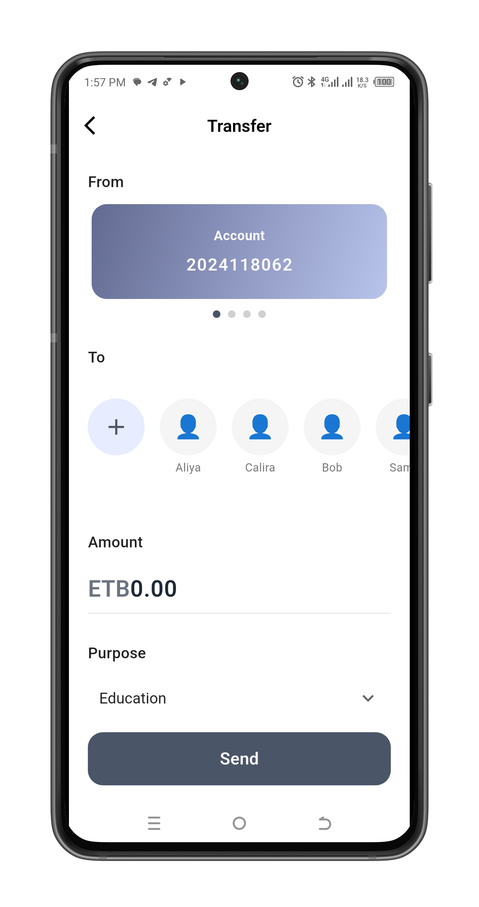

# Banking App Challenge

A comprehensive Flutter banking application built with BLoC state management, demonstrating modern mobile development practices and clean architecture principles.

## Screenshots

| 1                               | 2                               | 3                               |
|---------------------------------|---------------------------------|---------------------------------|
|  |  |  |

| 4                               | 5                               | 6                               |
|---------------------------------|---------------------------------|---------------------------------|
|  |  |  |

| 7                               |                                  
|---------------------------------|
|  | 


## 📱 Features

### Authentication

- **User Login**: Secure authentication with email and password
- **User Registration**: New user account creation
- **JWT Token Management**: Automatic token refresh and secure storage
- **Session Persistence**: Stay logged in across app restarts
- **Logout**: Secure session termination

### Account Management

- **Account Overview Dashboard**
  - Display all user bank accounts
  - Real-time balance information
  - Total balance calculation across all accounts
  - Account type badges (SAVINGS/CHECKING)
  - Pull-to-refresh functionality
  - Infinite scroll pagination

### Fund Transfer

- **Secure Money Transfer**
  - Select source account from dropdown
  - Validate recipient account number
  - Amount validation with balance checking
  - Optional transfer description
  - Real-time balance display
  - Transfer confirmation with success/error feedback

### Transaction History

- **Detailed Transaction Records**
  - Per-account transaction history
  - Visual indicators for credit/debit
  - Transaction amount and description
  - Smart date formatting (Just now, Yesterday, etc.)
  - Balance after each transaction
  - Pagination with lazy loading
  - Pull-to-refresh support

## 🏗️ Architecture

The app follows **Clean Architecture** principles with clear separation of concerns:

```
lib/
├── core/                    # Core functionality and utilities
│   ├── constants/          # API endpoints and app constants
│   ├── errors/             # Error handling and failure types
│   ├── network/            # API client and network configuration
│   └── utils/              # Utility functions and helpers
│
├── data/                   # Data layer
│   ├── datasources/        # Remote data sources for API calls
│   ├── models/             # Data models with JSON serialization
│   └── repositories/       # Repository implementations
│
├── domain/                 # Domain layer (business logic)
│   ├── entities/           # Business entities
│   ├── repositories/       # Repository interfaces
│   └── usecases/           # Business use cases
│
└── presentation/           # Presentation layer
    ├── bloc/               # BLoC state management
    │   ├── auth/           # Authentication BLoC
    │   ├── account/        # Account management BLoC
    │   └── transaction/    # Transaction BLoC
    ├── pages/              # Application screens
    └── widgets/            # Reusable UI components
```

## 🛠️ Technologies & Packages

### State Management

- **flutter_bloc** (^8.1.6): BLoC pattern implementation
- **bloc** (^8.1.4): Core BLoC library
- **equatable** (^2.0.5): Value equality for state classes

### Networking

- **dio** (^5.4.0): Advanced HTTP client with interceptors
- **http** (^1.1.0): HTTP networking
- **json_annotation** (^4.8.1): JSON serialization annotations
- **json_serializable** (^6.7.1): Code generation for JSON

### Storage

- **flutter_secure_storage** (^9.0.0): Secure storage for JWT tokens
- **shared_preferences** (^2.2.2): Key-value storage

### Navigation & UI

- **go_router** (^12.1.3): Declarative routing
- **flutter_spinkit** (^5.2.0): Loading animations
- **fluttertoast** (^8.2.4): Toast notifications

### Utilities

- **dartz** (^0.10.1): Functional programming (Either type for error handling)
- **build_runner** (^2.4.7): Code generation

## 🚀 Getting Started

### Prerequisites

- Flutter SDK (>=3.4.3 <4.0.0)
- Dart SDK
- iOS Simulator or Android Emulator
- IDE (VS Code or Android Studio recommended)

### Installation

1. **Clone the repository**

```bash
git clone https://github.com/Asrat001/banking_app_challenge.git
cd banking_app_challenge
```

2. **Install dependencies**

```bash
flutter pub get
```

3. **Generate code files**

```bash
flutter pub run build_runner build --delete-conflicting-outputs
```

4. **Run the app**

```bash
# For iOS
flutter run -d ios

# For Android
flutter run -d android
```

## 📡 API Configuration

The app connects to the banking API at `https://challenge-api.qena.dev`

### API Endpoints

- **Authentication**

  - `POST /auth/login` - User login
  - `POST /auth/register` - User registration
  - `POST /auth/refresh` - Refresh JWT token
  - `POST /auth/logout` - User logout

- **Accounts**

  - `GET /accounts` - Get user accounts (paginated)
  - `POST /accounts/transfer` - Transfer funds

- **Transactions**
  - `GET /transactions/{accountId}/history` - Get transaction history (paginated)

## 🔒 Security Features

- **JWT Token Management**: Automatic token refresh before expiration
- **Secure Storage**: Sensitive data stored using Flutter Secure Storage
- **Input Validation**: Comprehensive form validation
- **Error Handling**: Graceful error handling with user feedback
- **Session Management**: Automatic logout on token expiration

## 🧪 Testing

### Running Tests

```bash
# Run all tests
flutter test

# Run with coverage
flutter test --coverage
```

### Linting

```bash
# Analyze code
flutter analyze

# Format code
dart format .
```

## 📱 Screenshots

### Authentication Flow

- Login screen with email/password fields
- Registration screen for new users
- Form validation and error messages

### Main Features

- Dashboard with account overview
- Account cards showing balances
- Fund transfer form with validation
- Transaction history with pagination

## 🏃‍♂️ Performance Optimizations

- **Pagination**: Efficient data loading for large lists
- **Lazy Loading**: Load more data on scroll
- **Caching**: Smart caching of API responses
- **State Management**: Efficient state updates with BLoC
- **Code Splitting**: Modular architecture for better performance

## 📝 Code Quality

- **Clean Architecture**: Separation of concerns
- **SOLID Principles**: Maintainable and scalable code
- **Error Handling**: Comprehensive error management
- **Code Generation**: Automated boilerplate with build_runner
- **Linting**: Strict linting rules for code consistency

## 🤝 Contributing

1. Fork the repository
2. Create your feature branch (`git checkout -b feature/AmazingFeature`)
3. Commit your changes (`git commit -m 'Add some AmazingFeature'`)
4. Push to the branch (`git push origin feature/AmazingFeature`)
5. Open a Pull Request


## 📞 Contact

For questions or feedback about this project, please reach out through the repository issues.

---

**Note**: This app was developed as part of the Banking App Challenge to demonstrate proficiency in Flutter development, state management, and clean architecture principles.
